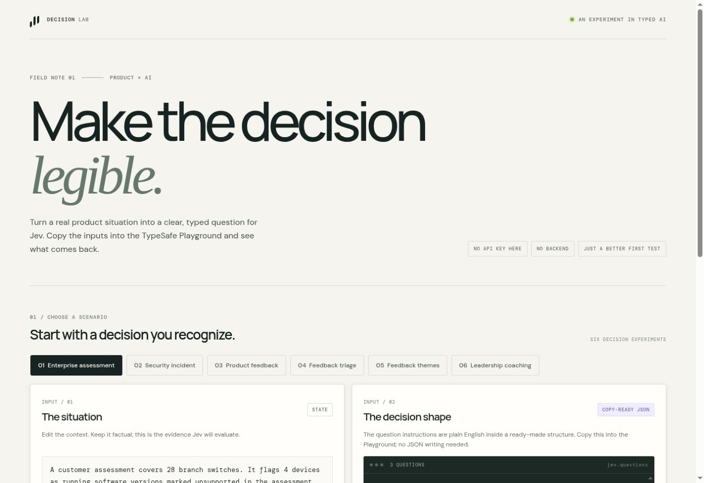

# Jev Decision Lab

An approachable, browser-based workbench for exploring **Jev**, TypeSafe AI's decision model. It helps you turn a sample situation into clear, structured questions, then try those questions in the [TypeSafe Jev Playground](https://console.typesafe.ai/playground).

## Try it now

[**Open the live Jev Decision Lab ↗**](https://nwadmark.github.io/jev-decision-lab/)

No repository setup is needed to use the live workbench.

## What is Jev?

A useful first approximation is to think of Jev as a **classifier for decisions inside software**. A chatbot is built to write a response for a person to read. Jev is built to evaluate a situation and return a structured answer that software can use.

You provide:

- **State:** the facts or description Jev should evaluate.
- **Typed questions:** the specific decisions you want Jev to make.

Jev returns answers in defined formats, along with probabilities (and, for Choice and Score questions, confidence). For example, give it a description of an object, ask “Which color is it?”, and provide a fixed list of colors. Jev can return a choice and a probability for each option. An app could use that kind of result to sort, route, flag, or send a case for human review.

Jev supports three question types:

| Type | Plain-language meaning | Example |
| --- | --- | --- |
| `choice` | Pick from a list of answers | Which team should review this request? |
| `score` | Rate against a defined scale | How urgent is this incident from 1 to 5? |
| `noul` | Estimate whether a statement is true | Does this case contain a security incident? |

Keep each question focused on one judgment. If a decision depends on several factors, ask about those separately and combine the results using your own rules. Probabilities can help you decide when to automate and when to ask a person to review; they are not a guarantee that an answer is correct.

## Customer feedback: a practical use case

A product or support team could evaluate each feedback message with focused questions such as:

- Which queue should receive it: billing, product support, engineering, or product feedback?
- Is the customer blocked or working against a stated deadline?
- Does the message describe a defect, a usability problem, or a missing capability?
- How much concrete evidence does it give for follow-up?

Your application can use the structured answers to route straightforward cases, flag uncertain ones for a person, and group feedback themes over time. Jev can help classify and triage each message; your product team still sets the taxonomy, review rules, and roadmap priorities. The new **Feedback triage** and **Feedback themes** examples in the workbench show two parts of this flow.

## Use an example

1. On the live demo above, choose an example that interests you.
2. Copy its **State** into the Playground's State area.
3. Copy its **Questions** into the Questions editor.
4. Run it, then change one fact and compare the result.

The workbench prepares the inputs; the Playground runs Jev. If you want to explore without using the live site, download the repository files and open `index.html` in a modern browser.

Maintainer: one-time GitHub Pages setup

The repository owner configures hosting once. Visitors do not need a GitHub account or a branch.

1. Open the repository's **Settings → Pages**.
2. Under **Build and deployment**, choose **Deploy from a branch**.
3. Select the existing **main** branch and **/(root)** folder, then click **Save**. Select `main`; do not create a new branch.
4. When GitHub shows **Your site is live at**, use **Visit site** and share that public link.

## Do I have to write JSON?

You can start by writing the question in plain English. In the Playground, that wording goes into the question's `instructions`. The Questions editor also needs a typed structure: the question type (`choice`, `score`, or `noul`) and, for Choice or Score, the allowed options or scoring criteria. A plain sentence by itself is not a complete Questions object.

You do **not** need to create JSON from scratch to try this project. Pick a workbench example and use **Copy questions**; it prepares the formatted JSON for you. If you want to make your own question, first write what you want to know in ordinary language, then use the Playground's **Add Question** control to choose a type and provide the wording and answer choices or criteria.

For example, start with: “Which team should handle this customer message?” Then choose `choice` and define possible answers such as Billing, Product Support, Engineering, Product Feedback, and Human Review.

## Usage and credits

The workbench itself is free to open and does not make Jev requests. Running a request in the Playground uses TypeSafe credits. TypeSafe's terms say promotional credits may be granted at its discretion, so this project does not promise a fixed number of free runs. If you see **“Your organization is out of funds,”** check the organization's **Billing** and **Usage** pages in the console. Only add funds if you choose to continue with paid usage.

No build step, dependency install, or API key is needed for this workbench. It only prepares the inputs: **it does not send a request to Jev or invent sample results.** Run copied inputs in the Playground to get Jev's answers. Use fictional or sanitized examples when experimenting.

## Included examples

- Enterprise assessment triage
- Security incident triage
- Product feedback and usability
- Customer feedback triage
- Feedback themes and product discovery
- Leadership interview coaching

## Project files

- `index.html` — workbench interface and instructions
- `styles.css` — responsive visual design
- `app.js` — scenario data, question rendering, and copy actions

## References

- [TypeSafe documentation](https://docs.typesafe.ai/introduction)
- [TypeSafe quick start](https://docs.typesafe.ai/introduction/quickstart)
- [TypeSafe AI: Jev and System One models](https://typesafe.ai/blog/introducing-system-one-models-and-jev)
- [TypeSafe customer agreement, section 8.2 (credits)](https://typesafe.ai/legal/mca)
- [Vercel announcement: Jev on AI Gateway](https://vercel.com/changelog/typesafe-ai-jev-now-available-on-ai-gateway)

This is an independent learning project and is not affiliated with or endorsed by TypeSafe AI.
